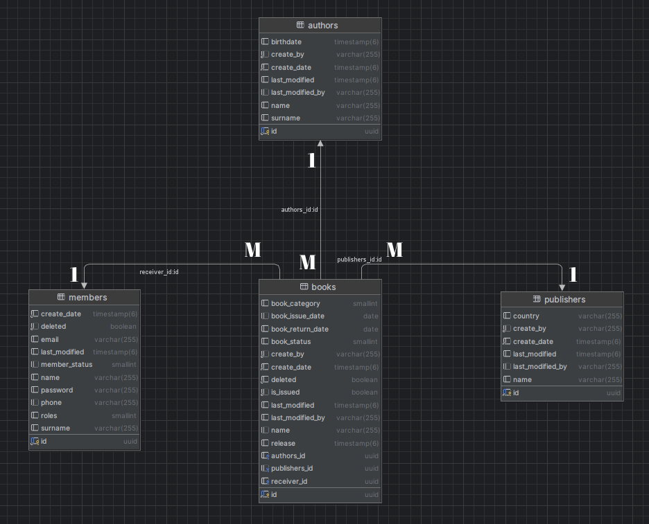

# Library Management System
## 1. INTRODUCTION
### 1.1 Purpose

* Restful Api, which allows users to register to the system and retrieve existing books from the library database.
### 1.2 Summary
* A USER account must be created to access the books.
* Users can only read books.
* An ADMIN account must be created to add, delete and edit books.
* Users and Admins can search for books by ID and name.
* Admins can add, delete and update books.
* Book issue and return transactions can be made with user and book IDs.
* User can issue a maximum of 5 books at the same time.
* If the user does not return the rented books within 10 days, he/she will pay a fine amount for each day.
* The date and who made the changes made to the books are kept.
</br></br></br>


## 2. TECHNOLOGIES

### 2.1 Environment and Tools
* Java 21
* Spring Boot 3.2.5
* Maven
  </br>
### 2.2 Library and Dependencies
* Spring Boot Data Jpa
* Auditing
* Hibernate
* Spring Boot Security
* Lombok
* Model Mapper
* SpringDoc OpenApi (Swagger 3)
* Spring Boot Validation
* Http Authentication and Authorization (Basic Auth)
  </br>
### 2.3 Database
* PostgreSql
  </br></br></br>


## 3. STRUCTURE
### 3.1 Architecture
> **REST** architecture implemented
* REST is an architecture that works over the HTTP protocol, which enables communication between client and server. REST is a transfer method used in software built on service-oriented architecture. It enables the application to communicate by carrying XML and JSON data between the client and the server. Services that use the REST architecture are called RESTful services.</br>

### 3.2 Principle
> Efforts were made to remain faithful to **SOLID** principles.
```
1. (S)ingle Responsibility Principle (SRP: Tek Sorumluluk Prensibi )
```
```
2. (O)pen/Closed Principle (OCP: Açık Kapalı Prensibi)
```
```
3. (L)iskov ‘s Substitution Principle (LSP: Liskov’un Yerine Geçme Prensibi )
```
```
4. (I)nterface Segregation Principle (ISP: Arayüz Ayrıştırma Prensibi )
```
```
5. (D)ependency Inversion Principle (DIP: Bağımlılık Ters Çevirme Prensibi )
```

</br></br></br>


## 4. ENDPOİNT
## Book
| HTTP Method | Endpoint                               | Description                               | Authority    |
|-------------|----------------------------------------|-------------------------------------------|--------------|
| POST        | /api/V1/books                          | Creates new book                          | ADMIN        |
| GET         | /api/V1/books                          | Get all books                             | ADMIN & USER |
| GET         | /api/V1/books/{id}                     | Get books by id                           | ADMIN & USER |
| GET         | /api/V1/books/search                   | Get books by name/Request param(bookName) | ADMIN & USER |
| PUT         | /api/V1/books/{id}                     | Updates existing book by id               | ADMIN        |
| DELETE      | /api/V1/books/{id}                     | Deletes book by id                        | ADMIN        |
| PUT         | /api/V1/books/{userId}/issue/{bookId}  | Issue books with User Id and Book Id      | ADMIN & USER |
| PUT         | /api/V1/books/{userId}/return/{bookId} | Returns books with User Id and Book Id    | ADMIN & USER |


## Member
| HTTP Method | Endpoint             | Description                                               | Authority           |
|-------------|----------------------|-----------------------------------------------------------|---------------------|
| POST        | /api/V1/members      | Creates new member                                        | ADMIN & USER        |
| GET         | /api/V1/members      | Get all member information                                | ADMIN               |
| GET         | /api/V1/members/me   | Get the requesting member information                     | ADMIN & USER        |
| PUT         | /api/V1/members/{id} | Updates the member according to Id (except Mail and Role) | ADMIN & USER        |
| DELETE      | /api/V1/members/{id  | Deletes member by id                                      | ADMIN & USER        |


## Author
| HTTP Method | Endpoint             | Description                          | Authority           |
|-------------|----------------------|--------------------------------------|---------------------|
| POST        | /api/V1/authors      | Creates new author                   | ADMIN & USER        |
| GET         | /api/V1/authors      | Get all author information           | ADMIN               |
| PUT         | /api/V1/authors/{id} | Updates the author according to Id   | ADMIN & USER        |
| DELETE      | /api/V1/authors/{id  | Deletes author by id                 | ADMIN & USER        |


## Publisher
| HTTP Method | Endpoint                | Description                           | Authority           |
|-------------|-------------------------|---------------------------------------|---------------------|
| POST        | /api/V1/publishers      | Creates new publisher                 | ADMIN & USER        |
| GET         | /api/V1/publishers      | Get all publisher information         | ADMIN               |
| PUT         | /api/V1/publishers/{id} | Updates the publisher according to Id | ADMIN & USER        |
| DELETE      | /api/V1/publishers/{id  | Deletes publisher by id               | ADMIN & USER        |


## 5. MODEL
### Member

>id: UUID</br>
name: (min:1, max:50) is required/only characters</br>
surname: (min:1, max:50) is required/only characters</br>
phone: (+90|0) is required/only Turkish phone</br>
email: Must be email type</br>
password: 1 uppercase, 1 lowercase, 1 special character and size 8-20 </br>
roles: (ADMIN|USER) is required</br>
memberStatus: (Active, Inactive, Invited)</br>
deleted: (Soft delete) Auto</br>
createDate: (LocalDateTime) Auto </br>
lastModified: (LocalDateTime) Auto </br>


### Book

>id: UUID</br>
name: (min:1, max:50) is required/only characters</br> 
release: (Release must be in the past) is required/only date</br>
bookCategory: (min:5, max:20) is required/only given category</br>
bookStatus: (Borrowed, Sold, In_Library, Deleted) Auto </br>
deleted: (Soft delete) Auto </br>
bookIssueDate: (Book issue date) Auto </br>
bookReturnDate: (Book return date) Auto </br>
isIssued: (Book is issue or not) Auto </br>
authors: (Many to one) Authors relationship </br>
publishers: (Many to one) Publishers elationship </br>
receiver: (Many to one) Members relatioship </br>
createDate: (LocalDateTime) create date, Auto </br>
lastModified: (LocalDateTime) modified date, Auto </br>
createBy: (Mail) Auto </br>
lastModifiedBy: (Mail) Auto </br>

### Author

>id: UUID</br>
name: (min:10, max:40) is required/only characters</br>
surname: (min:10, max:40) is required/only characters</br>
birthdate: (Birthdate must be in the past) is required/only date</br>
createDate: (LocalDateTime) create date, Auto </br>
lastModified: (LocalDateTime) modified date, Auto </br>
createBy: (Mail) Auto </br>
lastModifiedBy: (Mail) Auto </br>


### Publisher

>id: UUID</br>
name: (min:2, max:30) is required/only characters</br>
country: is required/only characters</br>
createDate: (LocalDateTime) create date, Auto </br>
lastModified: (LocalDateTime) modified date, Auto </br>
createBy: (Mail) Auto </br>
lastModifiedBy: (Mail) Auto </br>

</br></br>


## 6. TEST
### Member

```json
{
    "name": "Admin",
    "surname": "admin",
    "phone":"+905423351265",
    "email":"admin@gmail.com",
    "password":"Admin1453*",
    "roles":"ADMIN"
}
```
```json
{
    "name": "Abdullah",
    "surname": "Karakoç",
    "phone":"+905423351265",
    "email":"abdullah@gmail.com",
    "password":"Abdullah1453*",
    "roles":"USER"
}
```

### Book

```json
{
  "name": "Nutuk",
  "release": "1927-04-19",
  "bookCategory": "HISTORY",
  "authorId": "0511118e-a9c0-4288-86e7-1f96e973002e",
  "publisherId": "87774ae4-46c8-47df-8a91-a0c04d3e421e"
}
```

### Author

```json
{
  "name": "Mustafa Kemal",
  "surname": "Atatürk",
  "birthdate": "1881-02-18"
}
```

### Publisher

```json
{
  "name": "İş Bankası Kültür Yayınları",
  "country": "Türkiye"
}
```

</br></br>


## 7. RESULT
### Member

```json
{
  "id": "99f716bf-0d08-4aec-992e-e8f658343cb5",
  "name": "Uibee",
  "surname": "Lab",
  "phone": "+905423351265",
  "email": "uibee@gmail.com",
  "roles": "ADMIN",
  "createDate": "2024-05-24T16:17:16.873163",
  "lastModified": null
}
```
```json
{
  "id": "8a4f338e-e095-453f-8b40-abf88b0d5b08",
  "name": "Abdullah",
  "surname": "Karakoç",
  "phone": "+905423351265",
  "email": "abdullah@gmail.com",
  "roles": "USER",
  "createDate": "2024-05-24T16:21:26.996572",
  "lastModified": null
}
```

### Book

```json
{
  "id": "57138823-c5ca-4333-b21f-75d32fec0f7e",
  "name": "NUTUK",
  "release": "2024-05-20T00:00:00.000+00:00",
  "bookCategory": "HISTORY",
  "authors": {
    "id": "ad13e358-8cb8-4284-a152-cd3bfcedb833",
    "name": "Mustafa Kemal",
    "surname": "Atatürk",
    "birthdate": "1881-02-18T00:00:00.000+00:00",
    "createDate": "2024-05-24T16:17:22.988801",
    "lastModified": null,
    "createBy": "uibee@gmail.com",
    "lastModifiedBy": null
  },
  "publishers": {
    "id": "47bdea91-4436-4b1d-b3d5-b8af58ae5636",
    "name": "İş Bankası Kültür Yayınları",
    "country": "Türkiye",
    "createDate": "2024-05-24T16:17:29.128622",
    "lastModified": null,
    "createBy": "uibee@gmail.com",
    "lastModifiedBy":"uibee@gmail.com"
  },
  "createDate": "2024-05-24T16:18:27.952741",
  "lastModified": "2024-05-24T16:38:05.875595",
  "createBy": "uibee@gmail.com",
  "lastModifiedBy": "uibee@gmail.com"
}
```

### Author

```json
{
  "id": "ad13e358-8cb8-4284-a152-cd3bfcedb833",
  "name": "Mustafa Kemal",
  "surname": "Atatürk",
  "birthdate": "1881-02-18T00:00:00.000+00:00",
  "createDate": "2024-05-24T16:17:22.988801",
  "lastModified": null,
  "createBy": "uibee@gmail.com",
  "lastModifiedBy": null
}
```

### Publisher

```json
{
  "id": "47bdea91-4436-4b1d-b3d5-b8af58ae5636",
  "name": "İş Bankası Kültür Yayınları",
  "country": "Türkiye",
  "createDate": "2024-05-24T16:17:29.128622",
  "lastModified": null,
  "createBy": "uibee@gmail.com",
  "lastModifiedBy": null
}
```

</br></br></br>


## 6. ERD


</br></br></br>


